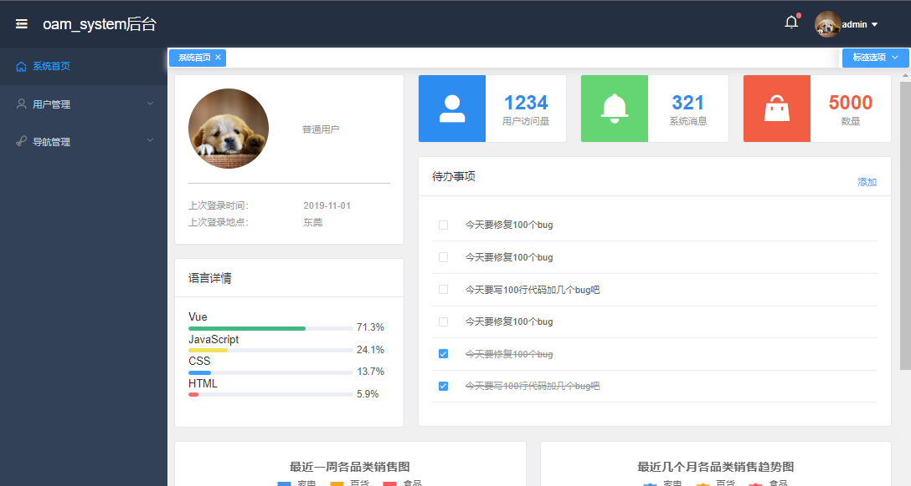
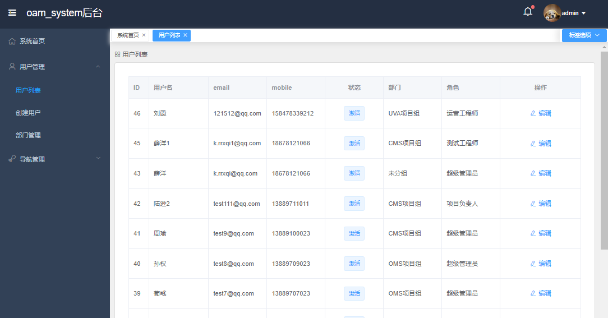
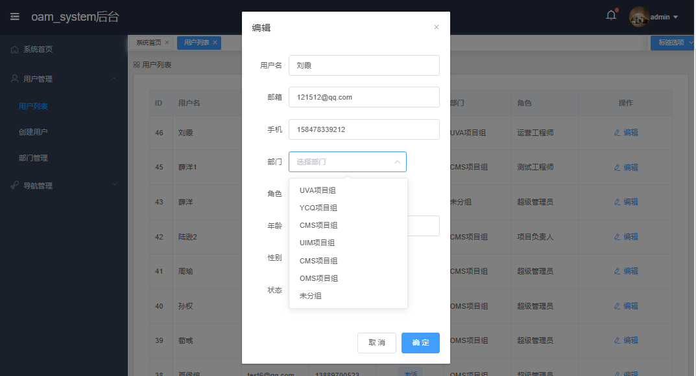
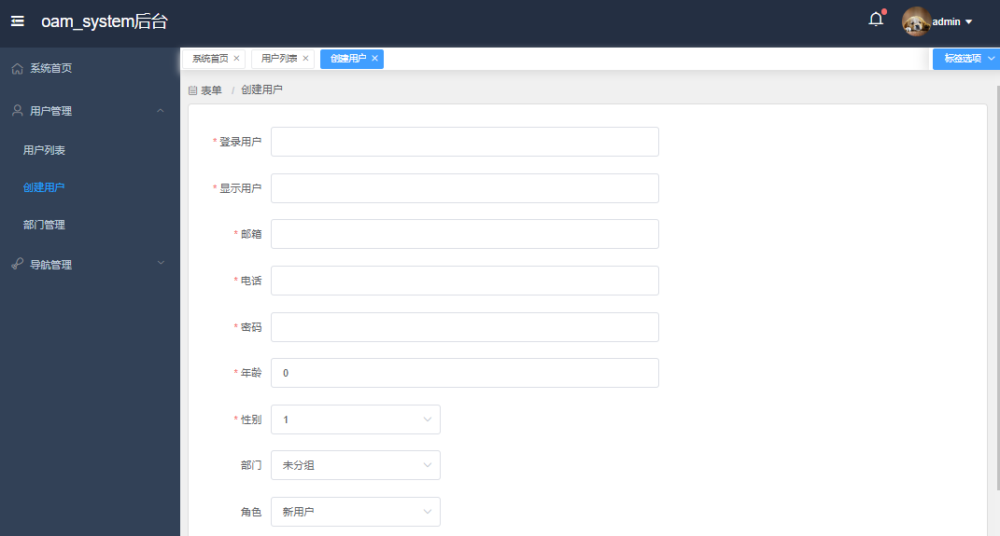
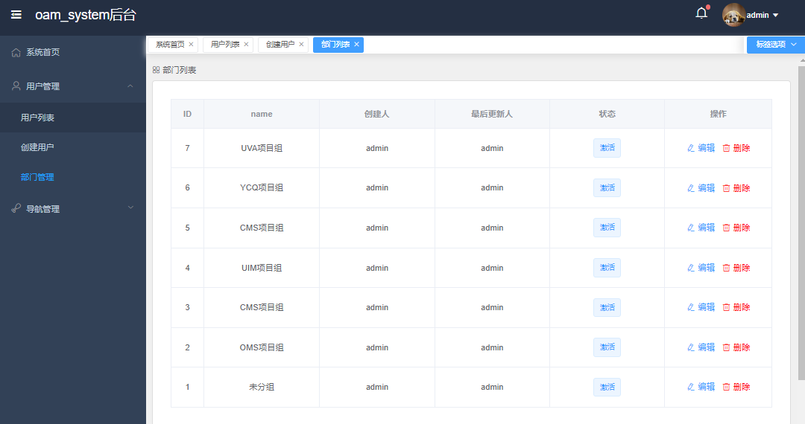
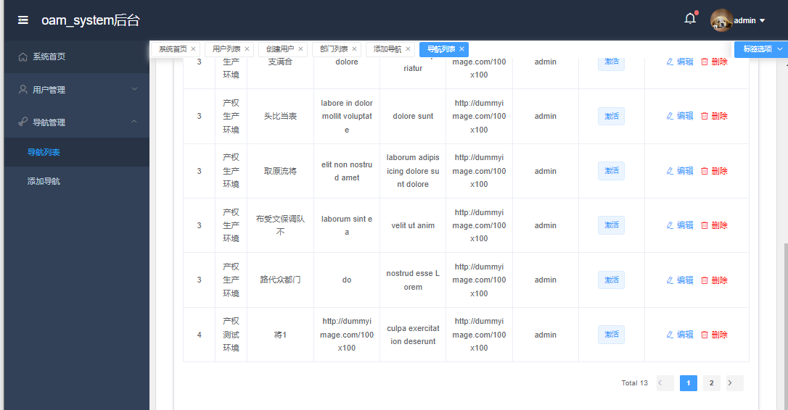
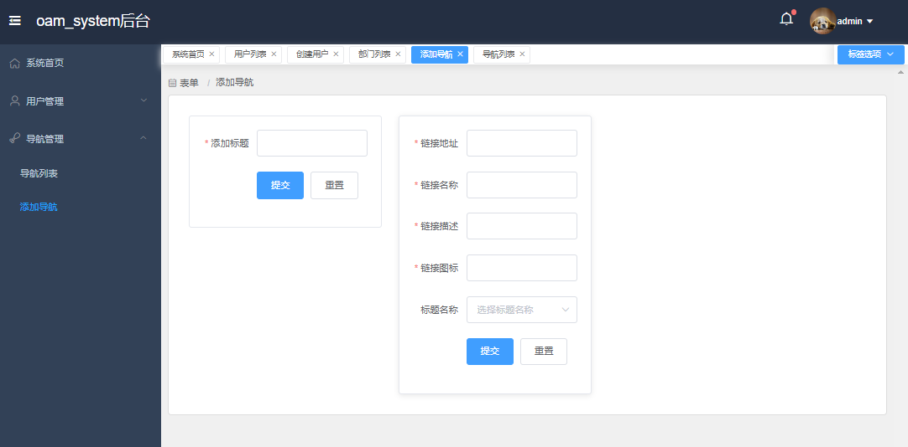

# oam_system

开放应用管理系统，集成用户管理工单管理导航维护等功能

# 构建工具集

```shell
#后端 
go-zero goctl 

#前段
vue vite axios element-plus pinia
```

# 依赖服务 

```shell
Mysql
Redis
```

# 快速开始

```shell

```

# K8s 部署

```shell

```

# 迭代计划


- [x] API-用户管理
- [x] 导航功能
- [ ] 工单管理-进行中


# 效果展示

## 登录


## 大盘



## 用户管理

### 用户列表




### 创建用户



### 部门管理



## 导航管理

### 导航列表



### 添加导航

